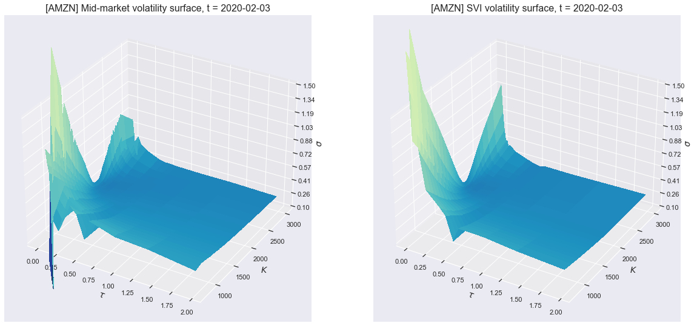

# volfitter
A Python package implementing a simple implied volatility fitter.

This package implements the Stochastic Volatility Inspired (SVI) model of 
[Gatheral 2004](papers/gatheral2004.pdf). The model is calibrated using an unconstrained
version of the quasi-explicit calibration methodology of 
[Zeliade 2012](papers/zeliade2012.pdf).

## Getting Started

After cloning the repository, navigate to the root of the project directory and install
the package by running

```shell
> pip install .
```

Then launch the command-line application by running

```shell
> volfitter
```

The process will run indefinitely until manually terminated, looping over all sample
data in `data/input/AMZN/` by default. It will not print any output to the console, but will log
to `logs/volfitter.log`. Tail this file to observe the progress of the fitter.

The fitted surface is written to a pickle file in `data/output/` by default.

## Project Structure

The most relevant parts of the project strucure are the following six directories:

```
├── data
├── docs
├── notebooks
├── papers
├── src
└── tests
```

- `data` contains the sample input data on which the application runs. I sourced data from the OptionMetrics vendor, accessed via Wharton Research Data Services (WRDS). The repository includes daily data for AMZN for calendar year 2020. (I selected AMZN because it does not pay dividends, in an attempt to limit difficulties arising from the American-ness of equity options.)
- `docs` contains a detailed writeup of the project.
- `notebooks` contains a sample Jupyter notebook for visualizing the volfitter's output.
- `papers` contains relevant papers describing the model and methodologies I implemented, as well as the OptionMetrics reference manual for the vended data format.
- `src` contains the code itself.
- `tests` contains unit, functional, and regression tests.

## Documentation

More detailed documentation of the volfitter is available at [`docs/volfitter_docs.md`](docs/volfitter_docs.md).
In particular, the documentation discusses

1. the architecture and design of the system;
2. the logic and available functionality;
3. and possible extensions and how they would fit into the design.

## Configuration

The application is configured using environment variables. (See 
[environ-config](https://environ-config.readthedocs.io/en/stable/index.html) for more
details.) To change any parameter from its default value, simply set the environment
variable before launching the application. For example,

```shell
> export VOLFITTER_FIT_INTERVAL_S=5
```

The parameter can be reverted to its default value like `unset VOLFITTER_FIT_INTERVAL_S`.

The following are the currently available user parameters:

```
VOLFITTER_SYMBOL (Optional, Default=AMZN): The underlying symbol.
VOLFITTER_VOLFITTER_MODE (Optional, Default=VolfitterMode.SAMPLE_DATA): Mode in which to run the volfitter.
VOLFITTER_LOG_FILE (Optional, Default=logs/volfitter.log): The log file.
VOLFITTER_FIT_INTERVAL_S (Optional, Default=10): Fit interval in seconds.
VOLFITTER_SURFACE_MODEL (Optional, Default=SurfaceModel.SVI): The implied volatility surface model to fit to the market.
VOLFITTER_SAMPLE_DATA_CONFIG_INPUT_DATA_PATH (Optional, Default=data/input): The input data path.
VOLFITTER_SAMPLE_DATA_CONFIG_OPTION_DATA_FILE_SUBSTRING (Optional, Default=option_data): Option data will be loaded from all files in the input directory whose filenames contain this substring.
VOLFITTER_SAMPLE_DATA_CONFIG_FORWARD_DATA_FILE_SUBSTRING (Optional, Default=forward_prices): Forward prices will be loaded from all files in the input directory whose filenames contain this substring.
VOLFITTER_SAMPLE_DATA_CONFIG_OUTPUT_DATA_PATH (Optional, Default=data/output): The output data path.
VOLFITTER_SAMPLE_DATA_CONFIG_OUTPUT_FILENAME (Optional, Default=final_iv_surface.pickle): The output filename.
VOLFITTER_RAW_IV_FILTERING_CONFIG_MIN_VALID_STRIKES_FRACTION (Optional, Default=0.1): An expiry needs at least this fraction of its strikes to have valid markets in order to be fit.
VOLFITTER_RAW_IV_FILTERING_CONFIG_MAX_LAST_TRADE_AGE_DAYS (Optional, Default=3): Filter out strikes which have not traded in more than this many business days.
VOLFITTER_RAW_IV_FILTERING_CONFIG_WIDE_MARKET_OUTLIER_MAD_THRESHOLD (Optional, Default=15): Filter out markets which are wider than this many median absolute deviations (MADs) beyond the median width of the expiry.
VOLFITTER_SVI_CONFIG_SVI_CALIBRATOR (Optional, Default=SVICalibrator.UNCONSTRAINED_QUASI_EXPLICIT): The calibrator to use for fitting the SVI model.
VOLFITTER_FINAL_IV_VALIDATION_CONFIG_CROSSED_PNL_WARN_THRESHOLD (Optional, Default=20): An expiry will be marked as WARN if its total crossed PnL exceeds this threshold.
VOLFITTER_FINAL_IV_VALIDATION_CONFIG_CROSSED_PNL_FAIL_THRESHOLD (Optional, Default=100): An expiry will be marked as FAIL if its total crossed PnL exceeds this threshold.
```

## Visualization Notebook

In addition to the command-line application, a notebook which runs the fitter on the
sample data and visualizes the output can be found at 
`notebooks/volfitter_visualization.ipynb`.

## Running Tests

Install the package along with its test dependencies by running

```shell
> pip install ".[test]"
```

Then the tests can be run from the command line simply by running

```shell
> pytest
```

This will run all tests: Unit, functional, and regression tests. Because the regression
tests are much slower than the other tests, they can be run separately via

```shell
> pytest -m regression
```

Similarly, the unit and functional tests can be run without regression tests via

```shell
> pytest -m "not regression"
```

I chose to supply a functional test in addition to the unit and regression tests because
functional tests give a quick, lightweight way to validate that all the components of the
system are working together as expected. They are thus higher-level than fine-grained unit tests,
but faster and simpler than regression tests in that they run on toy data. Regression
tests, by contrast, run on full, canned input data, often scraped from production scenarios.

These test types all differ from integration tests, which are similar to functional tests
but more focused on testing the integration of the system with external resources such as
databases or user interface layers. By contrast, functional tests are more concerned with
testing the functionality of the application itself.

## Examples

The below plot shows the full fitted AMZN surface on 2020-02-03: The plot on the left shows
the raw mid-market volatility surface, and the plot on the right shows the fitted SVI volatility
surface.



Below is shown the fitted SVI smile for the AMZN 2020-02-21 expiry on 2020-01-16, together
with raw market bid and ask IVs.


Both examples were produced by the notebook `notebooks/volfitter_visualization.ipynb`,
running the volfitter application using default configuration on the sample data in `data/input/AMZN/`.
