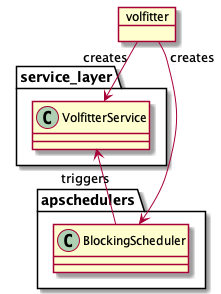
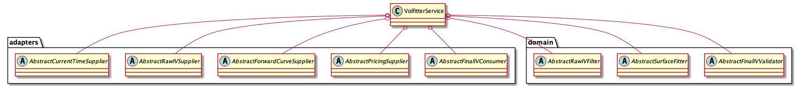
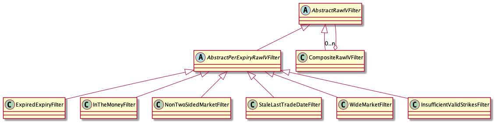
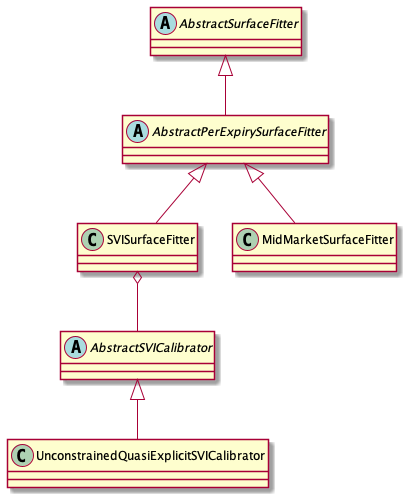
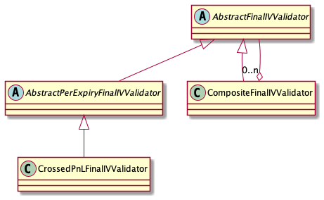
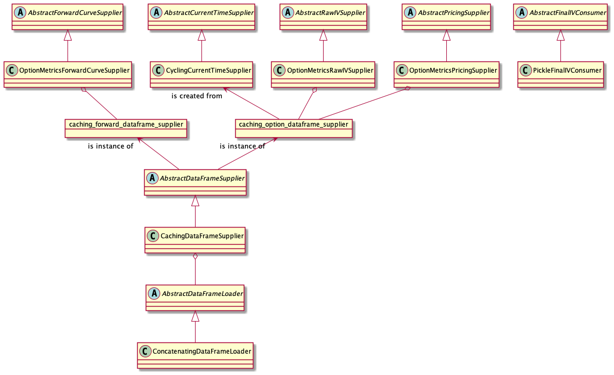
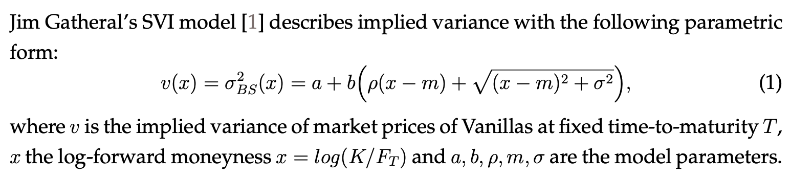

# volfitter

In this document I provide an overview of the volfitter application. The first section
discusses the architecture and design of the system; the second section describes the
logic and available functionality; and finally, the third section discusses possible
extensions and how they would fit into the design.

## Architecture and Design

This section describes the architecture and design of the volfitter application, discussing
the approach that was taken and some design choices made along the way. Additional discussion
of design choices and their consequences can be found in the "Discussion of Possible Extensions"
section.

### Overview

At a high level, the design of the system follows the 
[hexagonal architecture](https://en.wikipedia.org/wiki/Hexagonal_architecture_(software)), 
or ports and adapters, pattern. This pattern describes a design with a central application
core which is isolated from the environment in which it runs; the application core communicates
with the outside world via ports and adapters, which will be discussed in more detail below.

A main benefit of the hexagonal architecture is that it renders the system highly modular, making
it easy to run the core logic of the application in different setups and environments.

The application core consists of a [domain layer](https://en.wikipedia.org/wiki/Domain_model) 
containing the business logic (everything to do with options and vol fitting) and a service 
layer which orchestrates the functionality provided by the domain model.

Conceptually, the service layer expresses _what_ the application does (e.g., fit a full
surface from raw market IVs and validate the output), and the domain model expresses _how_
this is done. The service and domain layers are both written in language that is intelligible
to business domain experts (traders and quants). The adapters, meanwhile, contain all the
code related to databases and filesystems and networks and everything else that connects
the application to the outside world.

Driving all this are one or more entry points: An entry point is a thin layer that does
little more than boot up the system. Currently I supply just a single entry point, `volfitter.py`,
which is exposed as a command-line script when the volfitter is installed. It does nothing
more than gather the application configuration, create the service layer and plug in the 
adapters that are configured by the user, and start a timer which repeatedly triggers the service layer.

The package structure of the volfitter application is shown below. I'll now walk through
each of the important pieces in more detail; I will cover the various pieces in order of
the conceptual flow of logic, which differs from the (alphabetical) order in which they are
displayed in the package structure.

```
src
└── volfitter
    ├── adapters
    │   ├── current_time_supplier.py
    │   ├── final_iv_consumer.py
    │   ├── forward_curve_supplier.py
    │   ├── option_metrics_helpers.py
    │   ├── pricing_supplier.py
    │   ├── raw_iv_supplier.py
    │   └── sample_data_loader.py
    ├── domain
    │   ├── datamodel.py
    │   ├── final_iv_validation.py
    │   ├── fitter.py
    │   └── raw_iv_filtering.py
    ├── entrypoints
    │   └── volfitter.py
    ├── service_layer
    │   └── service.py
    ├── composition_root.py
    └── config.py
```

### Entry Points

An entry point is a thin layer that boots up the application. When the volfitter package
is installed, the entrypoint in `volfitter.py` is exposed as a command-line script. It does
the following (in addition to basic tasks like setting up logging):

- Load user configuration (see below).
- Ask the composition root (see below) to create the service layer and the configured adapters based on the user configuration.
- Create and start a timer which repeatedly triggers the service layer logic on an interval.

A UML diagram of the entry point's responsibilities is included below (`apschedulers` is
the third-party scheduler library I use for the timer):



### Configuration

The volfitter makes use of [environ-config](https://environ-config.readthedocs.io/en/stable/index.html)
for user configuration. The user parameters are set via environment variables. When the application
starts, a `VolfitterConfig` object is created from any parameter values that are found in the
process's environment variables; default values are used for any parameters that are not set.

Among the benefits of this approach are:

1. Configuration is encapsulated in a single object, `VolfitterConfig` (with subclasses for specific pieces of the application), which can be passed around where needed, preventing configuration code from being scattered throughout the codebase.
2. Setting parameters via environment variables makes deployment and running the application in different environments easy.
3. For use in tests, `environ-config` provides a light-weight way to create configuration objects from hard-coded values rather than reading from the environment.

The configuration lives in `config.py`. The specific user parameters that are available will be described in the "Logic and Functionality" section of this document.

### Dependency Injection and the Composition Root

The application is written with the principles of dependency inversion and dependency injection (DI)
in mind. Classes depend on abstract base classes rather than concrete implementations ("depend on abstractions, not
on concretions") and dependency injection is performed via the constructors. This ensures the
application is modular and that different implementations of various components can easily be swapped out.

For example, although I have implemented the SVI volatility model, switching to a different
model would be as easy as providing a different implementation of `AbstractSurfaceFitter`.
The implementation could be selected at runtime based on user configuration. Similarly,
I provide adapters to run the application on sample data, but it could easily be run live
or in backtest mode by providing different implementations of the I/O abstract base classes
and selecting the desired implementation at startup. In particular, the user can set the
parameter `VOLFITTER_VOLFITTER_MODE` to control whether the volfitter runs on sample data,
or live, or in backtest mode, etc. Currently only the sample data mode is implemented,
but this parameter is exposed to demonstrate how easy it would be to support additional modes.

The actual instantiation of the objects and the wiring together of the dependency graph is
done in `composition_root.py`, named after the
[composition root](https://stackoverflow.com/questions/6277771/what-is-a-composition-root-in-the-context-of-dependency-injection) 
pattern. As this is a simple application, I perform dependency injection by hand rather than
using a framework (also because dependency injection is not as common in the Python world as
it is in some other languages, so while DI frameworks for Python do exist, they are not
necessarily commonplace.)

### Service Layer

The service layer, together with the domain model, makes up the application core in our
hexagonal architecture. Conceptually, the service layer defines the use cases of the system:
It is "orchestration code" that uses the functionality provided by the domain model to perform
particular tasks, while getting input from and sending output to the ports and adapters that
surround the application core.

In the volfitter, I have implemented only a single use case, and thus there is currently only one method on the
service layer: `fit_full_surface`. Adding additional use cases or paths through the system,
such as a path to fit single market events rather than fitting the full surface, would be
achieved by adding new methods to the service layer that use the domain model in different ways.
This will be explored further in the "Discussion of Possible Extensions" section of this
document.

A UML diagram of `VolfitterService` is shown below. Some of its dependencies are ports
for input and output, and some dependencies are domain classes for carrying out business logic.
All dependencies are abstract so that the application can easily be run with different setups.



### Domain Model

The `domain` package contains the application's 
[domain model](https://en.wikipedia.org/wiki/Domain_model). Together with the service layer, 
the domain layer makes up the central application core. Following the principles of
[domain-driven design](https://en.wikipedia.org/wiki/Domain-driven_design), the domain
layer contains the business logic of the application. Conceptually, the language, requirements,
and functionality of the domain layer should be intelligible to business domain 
experts&mdash;in our case, traders and quants.

It contains both data, which I
put in `datamodel.py`, and behavior, which lives in the other sub-packages within
the domain layer. In particular, `datamodel.py` is part of the API over which the application
core communicates with the outside world. The adapters, discussed below, translate their
specific external resources to and from this domain API.

I will discuss the available functionality in the "Logic and Functionality" section, so
here I focus on the class hierarchy and dependency structure.

The volfitter must perform filtering of the raw IVs before passing them to the fitter. The
raw IV filters are shown in the below UML diagram. Although all currently available
filters are `AbstractPerExpiryRawIVFilter`s, they do not need to be: We could add a filter
that operates across all expiries, for example one that computes a wide market threshold
based on a global rather than per-expiry median.

The `CompositeRawIVFilter` is always the filter implementation with which the `VolfitterService`
is constructed: It contains an arbitrary number of other filters and applies them each in
turn, making the addition of new filters or the use of a subset of them extremely easy.



The below UML diagram shows the vol surface fitters themselves. At present I have implemented
one main fitter, for the SVI model. However I also provide a toy `MidMarketSurfaceFitter`,
mainly to show how easy it would be to swap out the surface model. The choice of `SVISurfaceFitter`
or `MidMarketSurfaceFitter` can be controled by the user via the `VOLFITTER_SURFACE_MODEL` parameter.

The `SVISurfaceFitter` has a calibrator, which itself can be swapped out via the
`VOLFITTER_SVI_CONFIG_SVI_CALIBRATOR` parameter. Currently only one calibrator is implemented,
but adding additional implementations would not be hard.



Finally, we need to perform validation on the final fitted IV surface. The structure of the
final IV validators is analogous to that of the raw IV filters, with a `CompositeFinalIVValidator`
allowing an arbitrary number of validators to be run in succession. Currently only a single
validator is implemented, but the design makes it simple to add new ones.



### Ports and Adapters

As mentioned above, the overall design of the system follows the 
[hexagonal architecture](https://en.wikipedia.org/wiki/Hexagonal_architecture_(software)), 
or ports and adapters, pattern. This pattern lends its name to the `adapters` package.

The hexagonal architecture describes a design wherein the application core is surrounded
by ports connecting it to the outside world; the ports are abstractions which define the
API, while concrete implementations of the ports, known as adapters, perform the actual
connection to specific external resources.

For example, `AbstractRawIVSupplier` is a 
port representing the location from which the application core retrieves raw
implied vol inputs. I provide an adapter for this port which supplies raw IVs from the
sample data included with the repository, `OptionMetricsRawIVSupplier` (OptionMetrics is
the vendor which provided my sample data). The idea is that the application can easily
be run in many different environments simply by plugging in different adapters. For example,
to run the application live, one would just need to provide an adapter supplying the live
vols and use this instead of `OptionMetricsRawIVSupplier` (and similarly for the other ports).

In our application, we represent ports via abstract base classes. The adapters are the
concrete subclasses of these abstract base classes. The use of abstract base classes is
not strictly necessary to implement this pattern in Python because one can rely on
Python's duck typing, but I find that explicitly defining the abstract base classes aids
in readability by making the ports explicit.

The below UML diagram shows the currently available ports and adapters. In the diagram,
the ports are the top row of abstract classes, and the adapters are the implementations 
beneath them.



A final comment is that the ports and adapters pattern makes it quite easy to test the
application or to run it in a notebook. In particular, the regression and functional tests
provide test adapters implementing the five ports: In terms of the above UML diagram, the
top layer of ports remains the same and everything below it is replaced with test adapters.
A similar pattern is used in the visualization notebook (although there I continue to use
some of the sample data adapters alongside the notebook-specific adapters).

## Logic and Functionality

In this section I provide a high-level overview of the currently available logic and
functionality. As this document is intended to focus more on the design than the algorithm
specifics, I stay at a high level in this section, mainly providing an overview of what
functionality is available.

### Overview

The volfitter is triggered on a timer and performs a full surface fit on each run, which
consists of the following steps:

1. Pull in raw IVs
2. Pull in the forward curve
3. Pull in option pricing (e.g., Greeks, moneyness, etc.)
4. Filter the raw IVs to remove "bad" input data
5. Fit the surface model to the filtered raw IVs
6. Validate the fitted surface
7. Export the fitted surface

The application is designed to be highly modular and configurable. The entire surface model
could be swapped out, but for this project I have chosen to implement the Stochastic 
Volatility Inspired (SVI) model of [Gatheral 2004](papers/gatheral2004.pdf). SVI is a five-parameter
model of the implied variance curve at each expiry. In addition to being parsimonious and
simple to calibrate, it has desirable theoretical properties: In particular, its asymptotics
conform to the result of [Lee 2002](papers/lee2002.pdf) that variance must be linear in
log-moneyness in the extreme wings.

A large practical downside of SVI, however, is that it often cannot fit the market well.
We see this quite extensively in our sample data: Five parameters simply are not enough
to accurately model modern equity vol surfaces, especially in the shorter maturities (less
than one week or so). Nevertheless, the model is instructive to consider for demonstrative
purposes.

I calibrate the model using an unconstrained version of the quasi-explicit calibration
methodology of [Zeliade 2012](papers/zeliade2012.pdf), which will be discussed in more
detail below. The calibrator could also easily be swapped out for a different implementation.

### Configuration

As discussed above, user configuration is done by setting environment variables. The following
user parameters are currently available:

```
VOLFITTER_SYMBOL (Optional, Default=AMZN): The underlying symbol.
VOLFITTER_VOLFITTER_MODE (Optional, Default=VolfitterMode.SAMPLE_DATA): Mode in which to run the volfitter.
VOLFITTER_LOG_FILE (Optional, Default=logs/volfitter.log): The log file.
VOLFITTER_FIT_INTERVAL_S (Optional, Default=10): Fit interval in seconds.
VOLFITTER_SURFACE_MODEL (Optional, Default=SurfaceModel.SVI): The implied volatility surface model to fit to the market.
VOLFITTER_SAMPLE_DATA_CONFIG_INPUT_DATA_PATH (Optional, Default=data/input): The input data path.
VOLFITTER_SAMPLE_DATA_CONFIG_OPTION_DATA_FILE_SUBSTRING (Optional, Default=option_data): Option data will be loaded from all files in the input directory whose filenames contain this substring.
VOLFITTER_SAMPLE_DATA_CONFIG_FORWARD_DATA_FILE_SUBSTRING (Optional, Default=forward_prices): Forward prices will be loaded from all files in the input directory whose filenames contain this substring.
VOLFITTER_SAMPLE_DATA_CONFIG_OUTPUT_DATA_PATH (Optional, Default=data/output): The output data path.
VOLFITTER_SAMPLE_DATA_CONFIG_OUTPUT_FILENAME (Optional, Default=final_iv_surface.pickle): The output filename.
VOLFITTER_RAW_IV_FILTERING_CONFIG_MIN_VALID_STRIKES_FRACTION (Optional, Default=0.1): An expiry needs at least this fraction of its strikes to have valid markets in order to be fit.
VOLFITTER_RAW_IV_FILTERING_CONFIG_MAX_LAST_TRADE_AGE_DAYS (Optional, Default=3): Filter out strikes which have not traded in more than this many business days.
VOLFITTER_RAW_IV_FILTERING_CONFIG_WIDE_MARKET_OUTLIER_MAD_THRESHOLD (Optional, Default=15): Filter out markets which are wider than this many median absolute deviations (MADs) beyond the median width of the expiry.
VOLFITTER_SVI_CONFIG_SVI_CALIBRATOR (Optional, Default=SVICalibrator.UNCONSTRAINED_QUASI_EXPLICIT): The calibrator to use for fitting the SVI model.
VOLFITTER_FINAL_IV_VALIDATION_CONFIG_CROSSED_PNL_WARN_THRESHOLD (Optional, Default=20): An expiry will be marked as WARN if its total crossed PnL exceeds this threshold.
VOLFITTER_FINAL_IV_VALIDATION_CONFIG_CROSSED_PNL_FAIL_THRESHOLD (Optional, Default=100): An expiry will be marked as FAIL if its total crossed PnL exceeds this threshold.
```

A few parameters allow the user to run the application in various "modes," but not all modes
are currently supported and are exposed merely to demonstrate how the design could be extended.
In particular:

#### VolfitterMode

`VOLFITTER_VOLFITTER_MODE` may either be set to `SAMPLE_DATA`, the default, `BACKTEST`, or
`LIVE`. The two modes `BACKTEST` and `LIVE` will currently result in `ValueError`s if used;
they are left in to demonstrate that to support these additional modes, one would merely
have to supply new adapters for the five ports to replace the sample data adapters I have
provided. This ease of reuse of the core application is a benefit of the hexagonal architecture.

#### SurfaceModel

`VOLFITTER_SURFACE_MODEL` currently supports either `SVI` (the default) or `MID_MARKET`.
The mid-market "model" just returns the midpoint vol at each strike, with no actual calibration.

#### SVICalibrator

`VOLFITTER_SVI_CONFIG_SVI_CALIBRATOR` may be `UNCONSTRAINED_QUASI_EXPLICIT` (the default)
or `VERTICAL_SPREAD_ARBITRAGE_FREE_QUASI_EXPLICIT` (not currently implemented and will result
in a `ValueError`). The arbitrage-free calibrator refers to the calibrator of Zeliade 2012
_with_ constraints. I have not implemented it, but it would be simple to do so and plug in.

### Raw IV Filtering

The first step of the volfitter is to filter out undesirable input data. "Filtering" means
the removal of individual options from the input data, as well as the flagging of entire
expiries that may be questionable. This is done by setting a `Status` tag on the curve
which may be either `OK`, `WARN`, or `FAIL`. Any input curves that are not `OK` will not
be fit by the fitter, and the `WARN` or `FAIL` status will be propagated to the final surface
consumer along with an empty curve for that expiry.

I have implemented the following filters:

#### ExpiredExpiryFilter

A safety check to remove expiries that have already expired but which are still included
in the input data. In our sample data, this happens on the day of expiry because the market
snapshot is taken right at the close. An expired expiry is set to `FAIL`.

#### InTheMoneyFilter

Remove in-the-money (ITM) options so that we fit only out-of-the-moneys (OTMs). The OTMs
are typically more tightly quoted and contain more useful information. More sophisticated
schemes are possible, such as taking a blend of near-ITMs and near-OTMs around at-the-money (ATM),
but here I favor the simplest approach.

#### NonTwoSidedMarketFilter

Remove any option that is either one-sided or completely empty.

More sophisticated approaches are possible, which would still consider the one side that _is_
available rather than discarding the market entirely, but here I again favor the simplest
approach.

#### StaleLastTradeDateFilter

Remove options whose last trade date is too far in the past, or which have never
traded. These tend to be the less-liquid options in the wings. Configured via the
`VOLFITTER_RAW_IV_FILTERING_CONFIG_MAX_LAST_TRADE_AGE_DAYS` parameter.

#### WideMarketFilter

Remove markets that are too wide. This check uses a per-expiry outlier detection
scheme based on the median and median absolute deviation (MAD) of the market widths
in that expiry. The median and MAD are measures of location and dispersion that are
statistically robust to outliers, so they are preferable to the mean and standard deviation
in outlier-detection applications.

We remove markets which are wider than a configurable number of MADs beyond the median
width, parameterized via `VOLFITTER_RAW_IV_FILTERING_CONFIG_WIDE_MARKET_OUTLIER_MAD_THRESHOLD`.

A possible extension would be to implement a global filter (using the median and MAD across
all expiries) in addition to the per-expiry filter.

#### InsufficientValidStrikesFilter

Finally, if an expiry has too few remaining strikes, either because it did not have enough
strikes listed in the first place or because we removed too many during the upstream filters,
we will mark the expiry as `FAIL` and not fit it.

This is controlled via the `VOLFITTER_RAW_IV_FILTERING_CONFIG_MIN_VALID_STRIKES_FRACTION`
parameter, which specifies the required strikes as a fraction of the originally listed strikes.

We also require there to be at least three strikes, because the SVI model (and, I suspect,
many models) cannot be fit to fewer than three points.

### Surface Fitters

I refer to the following excerpt from Zeliade 2012:



In the volfitter codebase, I give the five model parameters more descriptive names:

- `Level`, or `a`, gives the overall level of variance
- `Angle`, or `b`, gives the angle between the left and right asymptotes
- `Smoothness`, or `\sigma`, determines how smooth the vertex is
- `Tilt`, or `\rho`, determines the orientation of the graph
- Changing `center`, or `m`, translates the graph

I refer to [Gatheral 2004](papers/gatheral2004.pdf) and [Zeliade 2012](papers/zeliade2012.pdf)
for more details on the model and its calibration,
but here I will briefly describe the idea. Performing a change of variables, one
finds that given fixed values of `smoothness` and `center`, the optimal values of `level`,
`angle`, and `tilt` can be found explicitly by solving a linear system of equations.

(Zeliade 2012 include no-arbitrage constraints on this inner problem, which turns it into
a quadratic program with linear constraints, but I omit these because the constraints drastically
degrade the fit quality.)

Thus, we perform a two-stage calibration: An inner minimization is performed explicitly,
and the outer minimization just needs to solve for `smoothness` and `center`. The outer
minimization can use any reasonable general-purpose optimizer: I use the Nelder-Mead simplex algorithm,
which is a decent default choice and is also what Zeliade 2012 use.

### Final IV Validation

Before exporting the fitted IV surface to consumers, we must validate it. "Validation"
simply means setting the `Status` tag on the fitted smiles to `WARN` or `FAIL` if certain
checks are breached. The downstream consumers can then decide how to handle questionable
results.

Currently I have implemented just a single validation check, but as discussed in the "Architecture
and Design" section, it would be easy to add more.

#### CrossedPnLValidator

This validator computes the amount each fitted curve is through the market and computes
an aggregate number, in dollar terms, per expiry. This number, the expiry's "crossed PnL",
is compared to two user thresholds:

`VOLFITTER_FINAL_IV_VALIDATION_CONFIG_CROSSED_PNL_WARN_THRESHOLD` and
`VOLFITTER_FINAL_IV_VALIDATION_CONFIG_CROSSED_PNL_FAIL_THRESHOLD`.

If the `FAIL` threshold is breached, the expiry is marked as `FAIL`. If not, but if  the `WARN`
threshold is breached, the expiry is marked as `WARN`.

We first compute the crossed PnL per option by looking at how far the fitted vol at that strike
is through the bid or ask and multiplying this amount by vega to get a price-space number. These
per-option crossed PnLs are then summed per expiry.

It is important that the crossed PnL check is done for _all_ listed options in the expiry,
including ones that were filtered out and not included in the calibration! Even though a
market was not "good" enough for us to want to calibrate to it, it's still tradable and
would cost real money if we were through it.

## Discussion of Possible Extensions

In this section I briefly touch on some possible extensions and how they could be
incorporated into the design.

### Running the Fitter in Different Modes

This extension was mentioned above: To run the fitter live or in backtest mode, one would
simply have to provide new adapters for the input/output ports. There is an additional consideration
for a simulation or backtest mode, however, which is that we would want it to run as fast
as possible and so it should avoid recomputing any values that are not strictly necessary.

In the volfitter as it stands now (thinking about a production setup, rather than my sample
data), the raw input IVs would update on a higher frequency than the forward curves and
pricing values, so any downstream computations based on the forwards or pricing could be cached
and updated less often. The spot price _would_ update on a high frequency just like the option
markets, so while I don't use it in my current implementation, we could use high-frequency
spot prices to adjust any relevant slower-updating pricing values using a Taylor expansion
in the spot price.

Certain of the raw IV filters could also be skipped or simplified: For example, currently
the slowest part of the entire volfitter is actually the "stale last trade date" check. This
would be easy low-hanging fruit to speed up, but moreover, an intraday simulation would not
need to recompute this entire check every time.

Additionally, if the user is interested only in resimming the fitter with different parameters
for the surface model while leaving the filtering parameters unchanged,
then we could cache the results of the filtering and reuse them.

### Addition of New Surface Models

As discussed above, the design of the system makes it simple to plug in new surface model
implementations. Another key design choice that enabled this is the choice to represent the final
exported vol surface as a collection of vols per strike, rather than exporting the model parameters
themselves. For example, we could have chosen to export the five SVI parameters, and this
would have had the benefit of allowing downstream consumers to perfectly calculate the model
vol at _any_ moneyness point.

But, the big downside is that it would leak the specifics of the model out into the wider
ecosystem! Instead, by exporting the model vols themselves at each strike as we do now, we are not coupling
ourselves to any model.

The model-free choice comes with its own downside, which is that it is much harder to get
the vol at arbitrary strikes or moneyness points. This could be mitigated by exporting
the slope (`dVol/dStrike`) and curvature (`d2Vol/dStrike2`) along with the vol at every strike.
Then, consumers could do cubic spline interpolation, which still avoids coupling to a specific
model (although cubic spline interpolation can produce undesirable oscillations).


### Addition of New Calibrators

As discussed above, the design of the system also makes it easy to plug in different calibrators.
In particular, one could easily guarantee the absence of vertical spread abritrage by implementing
the constrained calibrator of Zeliade 2012. This is easy to implement using the `cvxpy` convex
optimization library.

### Fitting Single Market Events

Suppose we wanted to add a "fast path" to the system to quickly incorporate single market
events (such as large trades) without performing a full fit. This could be accomplished by
adding a new method to `VolfitterService` beside `fit_full_surface`. The new method would
represent the second use case orchestrated by our service layer!

The new method would use the domain model functionality in slightly different ways from `fit_full_surface`. For
example, it would short-circuit most, if not all, of the raw IV filtering. (We would likely have
specific safety checks for the fast path.) Rather than calling the full surface fitter, it would
retrieve the last-fit surface from a cache and call logic to apply the impact of the trade
on top.

This description of the fast-path functionality is not meant to be rigorous, but merely to
show how it could conveniently be architected into the system by leveraging the distinction between
the service layer and the domain model.

### Incorporating Vol Alphas

Similarly, incorporating vol alphas or opinionated vol leans into the system could be done
by leveraging the service layer/domain model distinction. In our current `fit_full_surface`
workflow, we could imagine a new stage being added between the current surface fit and the
final validation. This stage would apply vol alphas on top of the fitted surface. The alphas
themselves could arrive in the system via a new port and adapter.

Another consideration that arises here is that it may be desirable to export both the "mid-market"
fitted surface without alphas and the opinionated/alpha surface. For example, we may want to use
different surfaces for market-making and risk-taking strategies; or we may want surfaces with
alphas of different time horizons; or our market risk systems may want an unbiased vol surface
even if our trading systems use the biased surface (unless the risk systems have their own
entirely separate vol surface to reduce model risk).